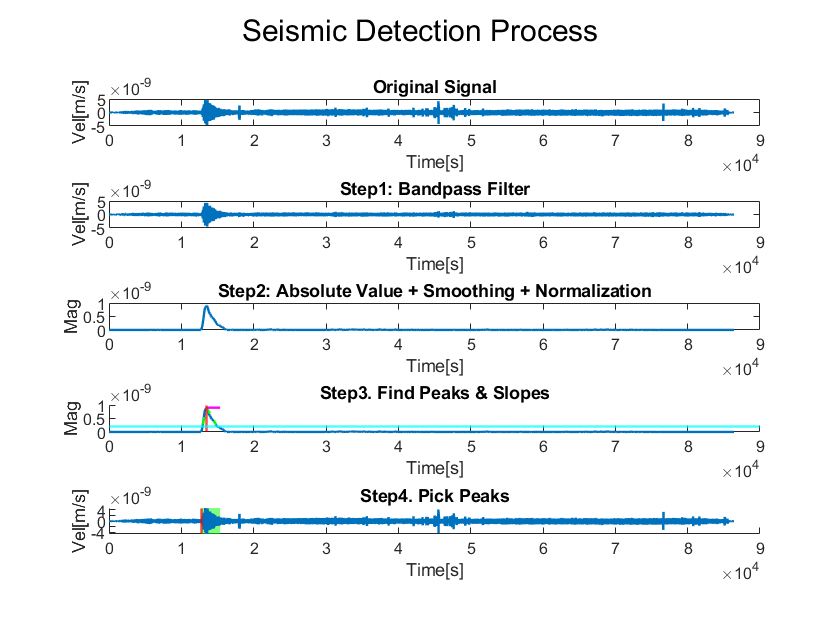

# NASA-App-Challenge

ℹ️ **Notice: the catalog data used for scoring is in the _catalog_ folder**

## How to run the code

You could run the **src/main.m** directly.
Simply change which celestial body your interested seismic event is on, and make sure to give the path to the original data (must in .csv format).

Have a nice day!

## About App

We've implemented an interactive MATLAB app for you to understand our project more, and you can check it out in _app_ folder. However, it requires _MATLAB Runtime R2024a_ to execute. If you're not sure whether your computer has that, select **app/DEMO.exe** to install both the app and the compiler.
If your computer already has the compiler, you can directly run the app, **app/INSTALL.exe**. There exists another simple README file for you to understand how the app works.

Unfortunately, this app can only run on Windows due to the limitation of MATLAB.

## Website demo

You can also access our [interactive website](https://rakechen-0307.github.io/detect-the-moooove) to further understand how our algorithm works.

> If the default files on the website fails, you can still upload *demo_lunar.csv" and *demo_mars.csv" to try it. Just don't forget change the celestial body at the left lower corner!

> If too many people access the website at the same time, the website will load the data quite slowly.

## File format

For both app and website demo, **you must follow the following format and store as csv file**.

| time_abs | time_rel | velocity |
| :------: | :------: | :------: |
|   XXX    |   YYY    |   ZZZ    |

The sampling time of Moon data is 0.1509 seconds, while the sampling time of Mars data is 0.0500 seconds. All data from [Space Apps 2024 Seismic Detection Data Packet](https://wufs.wustl.edu/SpaceApps/data/space_apps_2024_seismic_detection.zip) can be used directly.

## Code Description

The first part is initialization. Since we are using different filter parameters to fit on data from different celestial bodies, we should kindly ask you to check your "target body", and also tell the script where the data is. You will also be able to choose whether you would like to save the output figure or not. Should you want to save it, tell us where you want to save your figure.

The following parts are responsible for loading data and calculating important parameters, such as sampling time. Since our algorithm was designed based on the NASA provided data, only those data with formatting and sampling time same as that given by the NASA Space App Challenge will be interpreted and manipulated correctly.

**Step 1. Bandpass Filter**

In this step, we applied a bandpass filter to gather useful information hiding in the noisy signals. The bandwidth are decided based on gathered information and empirical modifications:

_Figure 1: Original data and filtered data_

It is clearly shown that several unwanted peaks are filted. This help us preliminary exclude some noises that we are not interested in. However, the signal is still too noisy to be analyzed.

**Step 2. Profile Generation**

In this step, we apply a series of filters to find the profile to the signal, while also amplifying the exponential-decay profile wanted.

1. Take the absolute value of the data.
2. Apply **Gaussian smoothing**: this is the critical step to handle those peaks that are not filtered out in Step 1.
3. Normalization: since most data are scale differently, we apply a normalization for the ease of further analysis.

_Figure 2: Filtered data and information obtained from profile generation._

**Step 3. Peak Detection**

1. Find the _peaks_, i.e. the intervals that exceeds a specified magnitude threshold: this is the easiest way to separate background noises (which often have less power) from seismic data. The threshold is represented as light blue line in _Fig.3_.
2. Find the maximum value, i.e. peaks, in each interval.

In _Fig 3._, We marked the locations of obtained maximum value with red vertical lines.

However, after running some cases, we noticed that there would be a type of seismic events which has two local maximums in the enveloping profile, with the latter one having greater power. Under this event, our initial assumption of the profile being a clean exponential-decay might fail as the "rising time" is overestimated. Therefore, we slightly changed our algorithm for this issue. To find the first peak instead of the second:

2. (modified) Find the first local maximum which exceeds the midpoint between the threshold and the maximum peak of the profile.
3. Mark the first local maximum as a alternative maximum value.

If there does exist two spikes, with the first intensit similar to that of the second, this method can succcesfully pick out the first. And if any minor spikes has intensity much lower than the original peak, then they will be filtered out by the modified second step, having no effect on the result.

**Step 4. Detect Seismic Events**

According to our observation and theoretical results, a typical quake signal would harbor a profile of shape similar to that of an exponential decay after a sudden rise. This can be easily characterized by calculating the average slope before and after the peak. For seismic events, the initial slope on the rising edge is much larger than that of the slow decaying falling edge. On the other hand, noises often have comparable rising and falling slope.

Under this assumption, we can detect the onset to the seismic events by calculating the rising slope and falling slope of each peak. This detection is done by following steps:

1. Mimicking the idea of full-width-half-maximum, we find the left and right point where their intensities are of a percentage to the peak. For our task, the percentage are chosen as 30 and 50%.
2. By connecting the left point to the peak, we obtain the rising edge slope. By connecting the peak to the right point, we obtain the falling edge slope.
3. Calculate the ratio of the former to the latter. If the absolute value is above a certain value, it means we have a gentle falling edge. We mark this as a seismic event. The slopes are marked as green dash line in _Fig. 3_.
4. The onset and ending to the seismic event is further obtained by extending the two slopes and find their intercept to the horizontal axis.

_Figure 3: Result of profile detection. The light blue line represents the detection threshold, the red vertical lines represent discovered peak positions, the green dotted lines represent the slopes to the left and right of the peaks, and the pink lines represent the magnitude of the slope ratio._

Besides finding the onset to the seismic event, our code also use the same idea to estimate the period of quake. However, this part is possible for further improvements.

_Figure 4. Results of seismic events detection. The red lines represent our detected starting time of seismic events, and the green box represents the duration of each event._

_Figure 5. The complete result_
